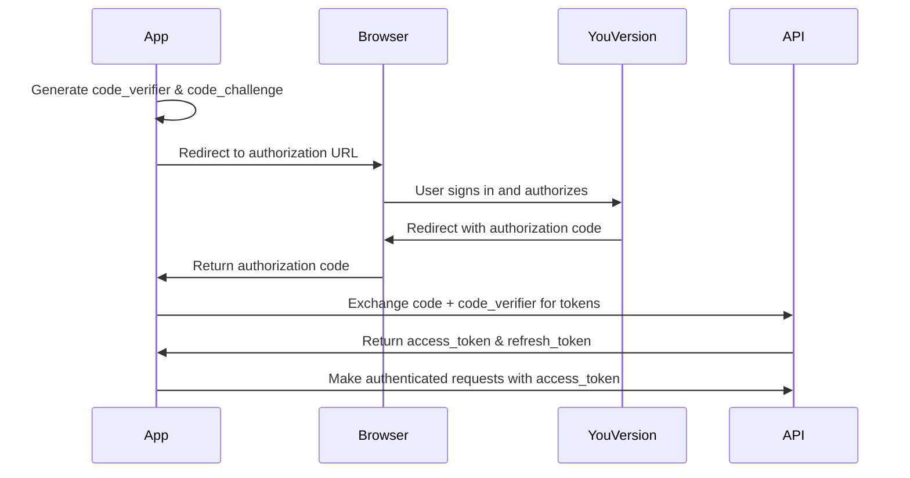

# Authentication

The `@youversion/platform-core` package provides OAuth 2.0 authentication using the PKCE (Proof Key for Code Exchange) flow. This is required for accessing user-specific endpoints like highlights.

<Note>
  Only the **HighlightsClient** requires authentication. BibleClient and LanguagesClient work without authentication.
</Note>

## OAuth 2.0 PKCE Flow

PKCE (RFC 7636) is a secure OAuth flow designed for public clients (like web and mobile apps) that cannot securely store client secrets.

### Flow Overview



## Quick Start

```typescript
import {
  SignInWithYouVersionPKCEAuthorizationRequestBuilder,
  YouVersionPlatformConfiguration
} from '@youversion/platform-core';

// 1. Generate authorization request
const authRequest = await SignInWithYouVersionPKCEAuthorizationRequestBuilder.make(
  'your-app-key',
  new URL('https://yourapp.com/callback'),
  ['profile', 'email'] // Optional scopes
);

// 2. Redirect user to authorization URL
window.location.href = authRequest.url.toString();

// 3. Handle callback (in your redirect URI handler)
const urlParams = new URLSearchParams(window.location.search);
const code = urlParams.get('code');
const state = urlParams.get('state');

// Verify state matches
if (state !== authRequest.parameters.state) {
  throw new Error('State mismatch - possible CSRF attack');
}

// 4. Exchange authorization code for tokens
const tokenRequest = SignInWithYouVersionPKCEAuthorizationRequestBuilder.tokenURLRequest(
  code!,
  authRequest.parameters.codeVerifier,
  'https://yourapp.com/callback'
);

const tokenResponse = await fetch(tokenRequest);
const tokens = await tokenResponse.json();

// 5. Save tokens
YouVersionPlatformConfiguration.saveAuthData(
  tokens.access_token,
  tokens.refresh_token,
  tokens.id_token,
  new Date(Date.now() + tokens.expires_in * 1000)
);

// 6. Now you can use authenticated endpoints
const highlightsClient = new HighlightsClient(apiClient);
const highlights = await highlightsClient.getHighlights();
```

## Step-by-Step Implementation

### Step 1: Configure Your App

First, set up your app configuration:

```typescript
import { YouVersionPlatformConfiguration } from '@youversion/platform-core';

// Set your app key
YouVersionPlatformConfiguration.appKey = 'your-app-key';

// Optional: Set API host (defaults to 'api.youversion.com')
YouVersionPlatformConfiguration.apiHost = 'api.youversion.com';
```

### Step 2: Generate Authorization Request

Create an authorization request with PKCE parameters:

```typescript
import { SignInWithYouVersionPKCEAuthorizationRequestBuilder } from '@youversion/platform-core';

const authRequest = await SignInWithYouVersionPKCEAuthorizationRequestBuilder.make(
  'your-app-key',
  new URL('https://yourapp.com/auth/callback'),
  ['profile', 'email'] // Optional scopes
);

// Store parameters for later verification
sessionStorage.setItem('auth_state', authRequest.parameters.state);
sessionStorage.setItem('code_verifier', authRequest.parameters.codeVerifier);
sessionStorage.setItem('nonce', authRequest.parameters.nonce);
```

**Parameters:**

<ParamField path="appKey" type="string" required>
  Your YouVersion Platform App Key
</ParamField>

<ParamField path="redirectURL" type="URL" required>
  Your app's callback URL where the user will be redirected after authorization
  
  Must match a redirect URI configured in your app settings
</ParamField>

<ParamField path="scopes" type="AuthenticationScopes[]">
  Optional OAuth scopes to request:
  - `"profile"` - Access to user profile information
  - `"email"` - Access to user email address
  
  The `"openid"` scope is automatically included
</ParamField>

**Returns:**

<ResponseField name="url" type="URL">
  The authorization URL to redirect the user to
</ResponseField>

<ResponseField name="parameters" type="SignInWithYouVersionPKCEParameters">
  PKCE parameters needed for token exchange:
  - `codeVerifier` - Random string for PKCE
  - `codeChallenge` - SHA256 hash of code verifier
  - `state` - Random state for CSRF protection
  - `nonce` - Random nonce for ID token validation
</ResponseField>

### Step 3: Redirect User to Authorization

Redirect the user to the authorization URL:

```typescript
// Full page redirect
window.location.href = authRequest.url.toString();

// Or open in a popup
const popup = window.open(
  authRequest.url.toString(),
  'youversion-auth',
  'width=500,height=600'
);
```

The user will:
1. See the YouVersion login page
2. Sign in with their credentials
3. Review and approve the requested permissions
4. Be redirected back to your callback URL

### Step 4: Handle Authorization Callback

In your callback route/page, handle the authorization response:

```typescript
// Parse URL parameters
const urlParams = new URLSearchParams(window.location.search);
const code = urlParams.get('code');
const state = urlParams.get('state');
const error = urlParams.get('error');

// Check for errors
if (error) {
  console.error('Authorization failed:', error);
  const errorDescription = urlParams.get('error_description');
  throw new Error(`OAuth error: ${error} - ${errorDescription}`);
}

// Verify state to prevent CSRF attacks
const storedState = sessionStorage.getItem('auth_state');
if (state !== storedState) {
  throw new Error('State mismatch - possible CSRF attack');
}

// Retrieve stored code verifier
const codeVerifier = sessionStorage.getItem('code_verifier');
if (!codeVerifier) {
  throw new Error('Code verifier not found');
}

// Clean up session storage
sessionStorage.removeItem('auth_state');
sessionStorage.removeItem('code_verifier');
sessionStorage.removeItem('nonce');
```

### Step 5: Exchange Code for Tokens

Exchange the authorization code for access and refresh tokens:

```typescript
import { SignInWithYouVersionPKCEAuthorizationRequestBuilder } from '@youversion/platform-core';

// Create token request
const tokenRequest = SignInWithYouVersionPKCEAuthorizationRequestBuilder.tokenURLRequest(
  code!,
  codeVerifier,
  'https://yourapp.com/auth/callback' // Must match the original redirect URI
);

// Exchange code for tokens
const tokenResponse = await fetch(tokenRequest);

if (!tokenResponse.ok) {
  const error = await tokenResponse.text();
  throw new Error(`Token exchange failed: ${error}`);
}

const tokens = await tokenResponse.json();
```

**Token Response:**

```json
{
  "access_token": "eyJhbGciOiJSUzI1NiIs...",
  "token_type": "Bearer",
  "expires_in": 3600,
  "refresh_token": "eyJhbGciOiJSUzI1NiIs...",
  "id_token": "eyJhbGciOiJSUzI1NiIs...",
  "scope": "openid profile email"
}
```

### Step 6: Save Tokens

Store the tokens using `YouVersionPlatformConfiguration`:

```typescript
import { YouVersionPlatformConfiguration } from '@youversion/platform-core';

YouVersionPlatformConfiguration.saveAuthData(
  tokens.access_token,
  tokens.refresh_token,
  tokens.id_token,
  new Date(Date.now() + tokens.expires_in * 1000)
);

// Tokens are now stored in localStorage and available globally
console.log('Access token saved:', YouVersionPlatformConfiguration.accessToken);
console.log('Token expires:', YouVersionPlatformConfiguration.tokenExpiryDate);
```

<Warning>
  **Security Note:** Tokens are stored in `localStorage` by default. This is vulnerable to XSS attacks. For production apps, consider using secure, HTTP-only cookies or a custom storage strategy.
</Warning>

### Step 7: Use Authenticated Endpoints

Now you can call authenticated endpoints:

```typescript
import { ApiClient, HighlightsClient } from '@youversion/platform-core';

const apiClient = new ApiClient({ appKey: 'your-app-key' });
const highlightsClient = new HighlightsClient(apiClient);

// The client automatically uses the stored access token
const highlights = await highlightsClient.getHighlights();

console.log(`User has ${highlights.data.length} highlights`);
```

## Storage Strategies

The package provides flexible storage strategies for authentication state during the OAuth flow.

### SessionStorageStrategy (Default)

Stores data in browser `sessionStorage` (cleared when tab closes):

```typescript
import { SessionStorageStrategy } from '@youversion/platform-core';

const storage = new SessionStorageStrategy();
storage.setItem('key', 'value');
const value = storage.getItem('key');
storage.removeItem('key');
```

<Warning>
  **XSS Vulnerability:** SessionStorage can be accessed by any JavaScript running on your page. Ensure proper XSS protection.
</Warning>

### MemoryStorageStrategy

Stores data in memory (cleared on page refresh):

```typescript
import { MemoryStorageStrategy } from '@youversion/platform-core';

const storage = new MemoryStorageStrategy();
storage.setItem('key', 'value');
const value = storage.getItem('key');

// Note: Data is lost on page refresh
```

**Benefits:**
- Better XSS protection than sessionStorage
- No persistent storage

**Drawbacks:**
- Requires re-authentication on page reload

### Custom Storage Strategy

Implement your own storage (e.g., encrypted cookies):

```typescript
import type { StorageStrategy } from '@youversion/platform-core';

class SecureCookieStorage implements StorageStrategy {
  setItem(key: string, value: string): void {
    // Set secure, HTTP-only cookie via your backend
    fetch('/api/auth/set-cookie', {
      method: 'POST',
      body: JSON.stringify({ key, value })
    });
  }

  getItem(key: string): string | null {
    // Retrieve from secure cookie
    // Implementation depends on your backend
    return null;
  }

  removeItem(key: string): void {
    // Delete cookie
  }

  clear(): void {
    // Clear all auth cookies
  }
}

const storage = new SecureCookieStorage();
```

## Token Management

### Checking Token Expiry

```typescript
import { YouVersionPlatformConfiguration } from '@youversion/platform-core';

function isTokenExpired(): boolean {
  const expiryDate = YouVersionPlatformConfiguration.tokenExpiryDate;
  
  if (!expiryDate) {
    return true;
  }
  
  // Check if token expires within the next 5 minutes
  const bufferMs = 5 * 60 * 1000;
  return Date.now() + bufferMs >= expiryDate.getTime();
}

if (isTokenExpired()) {
  // Refresh the token or re-authenticate
}
```

### Refreshing Tokens

<Warning>
  The current SDK version doesn't include a built-in token refresh method. You'll need to implement this manually.
</Warning>

```typescript
async function refreshAccessToken() {
  const refreshToken = YouVersionPlatformConfiguration.refreshToken;
  
  if (!refreshToken) {
    throw new Error('No refresh token available');
  }

  const response = await fetch('https://api.youversion.com/auth/token', {
    method: 'POST',
    headers: {
      'Content-Type': 'application/x-www-form-urlencoded',
    },
    body: new URLSearchParams({
      grant_type: 'refresh_token',
      refresh_token: refreshToken,
      client_id: YouVersionPlatformConfiguration.appKey!,
    }),
  });

  if (!response.ok) {
    throw new Error('Token refresh failed');
  }

  const tokens = await response.json();

  YouVersionPlatformConfiguration.saveAuthData(
    tokens.access_token,
    tokens.refresh_token,
    tokens.id_token,
    new Date(Date.now() + tokens.expires_in * 1000)
  );

  return tokens.access_token;
}
```

### Clearing Tokens (Logout)

```typescript
import { YouVersionPlatformConfiguration } from '@youversion/platform-core';

function logout() {
  YouVersionPlatformConfiguration.clearAuthTokens();
  
  // Redirect to login or home page
  window.location.href = '/';
}
```

## OAuth Scopes

Request specific permissions using OAuth scopes:

<ParamField path="profile" type="scope">
  Access to user profile information (name, profile picture)
</ParamField>

<ParamField path="email" type="scope">
  Access to user email address
</ParamField>

<ParamField path="openid" type="scope">
  OpenID Connect authentication (automatically included)
</ParamField>

<Note>
  Additional scopes for highlights (`read_highlights`, `write_highlights`) are requested automatically by the HighlightsClient.
</Note>

```typescript
// Request profile and email scopes
const authRequest = await SignInWithYouVersionPKCEAuthorizationRequestBuilder.make(
  'your-app-key',
  redirectURL,
  ['profile', 'email']
);

// The authorization URL will include these scopes
// User must approve each requested permission
```

## Complete Example

Here's a complete React example with authentication:

```typescript
import { useEffect, useState } from 'react';
import {
  ApiClient,
  HighlightsClient,
  SignInWithYouVersionPKCEAuthorizationRequestBuilder,
  YouVersionPlatformConfiguration,
  type Highlight
} from '@youversion/platform-core';

export function AuthExample() {
  const [highlights, setHighlights] = useState<Highlight[]>([]);
  const [isAuthenticated, setIsAuthenticated] = useState(false);

  useEffect(() => {
    // Check if already authenticated
    const accessToken = YouVersionPlatformConfiguration.accessToken;
    setIsAuthenticated(!!accessToken);

    // Handle OAuth callback
    const urlParams = new URLSearchParams(window.location.search);
    const code = urlParams.get('code');
    
    if (code) {
      handleAuthCallback(code);
    }
  }, []);

  async function handleLogin() {
    // Generate authorization request
    const authRequest = await SignInWithYouVersionPKCEAuthorizationRequestBuilder.make(
      process.env.REACT_APP_YOUVERSION_APP_KEY!,
      new URL(window.location.origin + '/callback'),
      ['profile', 'email']
    );

    // Store PKCE parameters
    sessionStorage.setItem('auth_state', authRequest.parameters.state);
    sessionStorage.setItem('code_verifier', authRequest.parameters.codeVerifier);

    // Redirect to authorization
    window.location.href = authRequest.url.toString();
  }

  async function handleAuthCallback(code: string) {
    try {
      // Verify state
      const urlParams = new URLSearchParams(window.location.search);
      const state = urlParams.get('state');
      const storedState = sessionStorage.getItem('auth_state');

      if (state !== storedState) {
        throw new Error('State mismatch');
      }

      // Get code verifier
      const codeVerifier = sessionStorage.getItem('code_verifier');
      if (!codeVerifier) {
        throw new Error('Code verifier not found');
      }

      // Exchange code for tokens
      const tokenRequest = SignInWithYouVersionPKCEAuthorizationRequestBuilder.tokenURLRequest(
        code,
        codeVerifier,
        window.location.origin + '/callback'
      );

      const response = await fetch(tokenRequest);
      const tokens = await response.json();

      // Save tokens
      YouVersionPlatformConfiguration.saveAuthData(
        tokens.access_token,
        tokens.refresh_token,
        tokens.id_token,
        new Date(Date.now() + tokens.expires_in * 1000)
      );

      setIsAuthenticated(true);

      // Clean up URL and storage
      window.history.replaceState({}, document.title, '/');
      sessionStorage.removeItem('auth_state');
      sessionStorage.removeItem('code_verifier');

      // Fetch highlights
      await fetchHighlights();
    } catch (error) {
      console.error('Authentication failed:', error);
    }
  }

  async function fetchHighlights() {
    const apiClient = new ApiClient({
      appKey: process.env.REACT_APP_YOUVERSION_APP_KEY!
    });
    const highlightsClient = new HighlightsClient(apiClient);

    const result = await highlightsClient.getHighlights();
    setHighlights(result.data);
  }

  function handleLogout() {
    YouVersionPlatformConfiguration.clearAuthTokens();
    setIsAuthenticated(false);
    setHighlights([]);
  }

  if (!isAuthenticated) {
    return (
      <button onClick={handleLogin}>
        Sign in with YouVersion
      </button>
    );
  }

  return (
    <div>
      <button onClick={handleLogout}>Logout</button>
      
      <h2>Your Highlights</h2>
      {highlights.length === 0 ? (
        <p>No highlights yet</p>
      ) : (
        <ul>
          {highlights.map(h => (
            <li key={h.passage_id}>
              {h.passage_id} - #{h.color}
            </li>
          ))}
        </ul>
      )}
    </div>
  );
}
```

## Security Best Practices

<AccordionGroup>
  <Accordion title="Always verify the state parameter">
    The state parameter prevents CSRF attacks. Always verify it matches:
    
    ```typescript
    if (state !== storedState) {
      throw new Error('State mismatch - possible CSRF attack');
    }
    ```
  </Accordion>
  
  <Accordion title="Use HTTPS in production">
    OAuth requires HTTPS in production. Redirect URIs must use `https://`:
    
    ```typescript
    // ✅ Production
    new URL('https://yourapp.com/callback')
    
    // ✅ Development only
    new URL('http://localhost:3000/callback')
    ```
  </Accordion>
  
  <Accordion title="Store tokens securely">
    Default localStorage storage is vulnerable to XSS. For production:
    
    - Use HTTP-only cookies via your backend
    - Implement Content Security Policy (CSP)
    - Sanitize all user input
    - Use a custom secure storage strategy
  </Accordion>
  
  <Accordion title="Implement token refresh">
    Refresh tokens before they expire:
    
    ```typescript
    // Check expiry before making requests
    if (isTokenExpired()) {
      await refreshAccessToken();
    }
    ```
  </Accordion>
  
  <Accordion title="Handle authentication errors">
    Gracefully handle auth failures:
    
    ```typescript
    try {
      const highlights = await highlightsClient.getHighlights();
    } catch (error) {
      const httpError = error as Error & { status?: number };
      
      if (httpError.status === 401) {
        // Token expired or invalid - re-authenticate
        await handleLogin();
      }
    }
    ```
  </Accordion>
</AccordionGroup>

## API Reference

### SignInWithYouVersionPKCEAuthorizationRequestBuilder

<ParamField path="make()" type="static async method">
  Generates an authorization request with PKCE parameters
  
  **Parameters:**
  - `appKey: string` - Your app key
  - `redirectURL: URL` - Callback URL
  - `scopes?: AuthenticationScopes[]` - OAuth scopes
  
  **Returns:** `Promise<SignInWithYouVersionPKCEAuthorizationRequest>`
</ParamField>

<ParamField path="tokenURLRequest()" type="static method">
  Creates a token exchange request
  
  **Parameters:**
  - `code: string` - Authorization code
  - `codeVerifier: string` - PKCE code verifier
  - `redirectUri: string` - Callback URL (must match original)
  
  **Returns:** `Request` - Fetch Request object
</ParamField>

### YouVersionPlatformConfiguration

<ParamField path="saveAuthData()" type="static method">
  Saves authentication tokens to localStorage
  
  **Parameters:**
  - `accessToken: string | null`
  - `refreshToken: string | null`
  - `idToken: string | null`
  - `expiryDate: Date | null`
</ParamField>

<ParamField path="clearAuthTokens()" type="static method">
  Removes all auth tokens from localStorage
</ParamField>

<ParamField path="accessToken" type="static getter">
  Gets the current access token from localStorage
  
  **Returns:** `string | null`
</ParamField>

<ParamField path="refreshToken" type="static getter">
  Gets the current refresh token from localStorage
  
  **Returns:** `string | null`
</ParamField>

<ParamField path="idToken" type="static getter">
  Gets the current ID token from localStorage
  
  **Returns:** `string | null`
</ParamField>

<ParamField path="tokenExpiryDate" type="static getter">
  Gets the token expiry date from localStorage
  
  **Returns:** `Date | null`
</ParamField>

## Related

- [HighlightsClient](/api/core/highlights-client) - Requires authentication
- [ApiClient](/api/core/api-client) - HTTP client for authenticated requests
- [OAuth 2.0 PKCE Specification](https://datatracker.ietf.org/doc/html/rfc7636)
