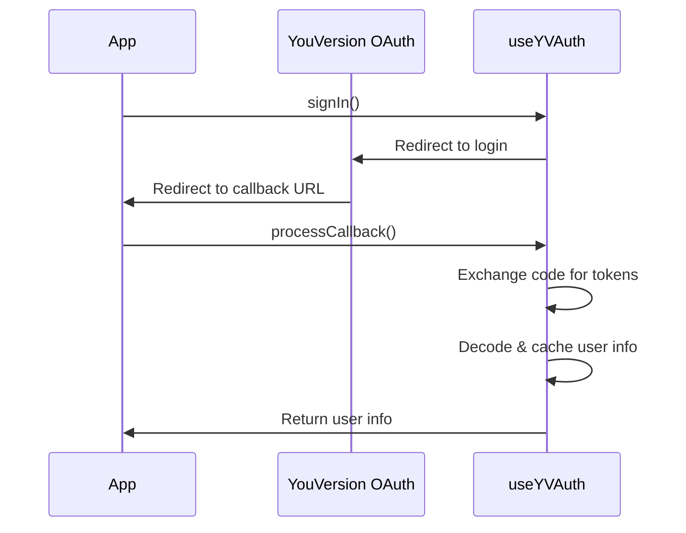

Authentication hooks provide OAuth-based user authentication with YouVersion. They handle sign-in, callback processing, and session management.

## useYVAuth

Comprehensive authentication hook that provides complete auth functionality including sign-in, sign-out, callback processing, and user info.

<Warning>
  Requires `YouVersionProvider` with `includeAuth={true}` and `authRedirectUrl` configured.
</Warning>

### Returns

<ResponseField name="auth" type="AuthenticationState">
  Complete authentication state object
  
  <Expandable title="AuthenticationState properties">
    <ResponseField name="isAuthenticated" type="boolean">
      Whether user is currently authenticated
    </ResponseField>
    
    <ResponseField name="isLoading" type="boolean">
      Whether auth state is being initialized or updated
    </ResponseField>
    
    <ResponseField name="accessToken" type="string | null">
      OAuth access token (for API requests)
    </ResponseField>
    
    <ResponseField name="idToken" type="string | null">
      JWT ID token (contains user info)
    </ResponseField>
    
    <ResponseField name="error" type="Error | null">
      Error if authentication failed
    </ResponseField>
  </Expandable>
</ResponseField>

<ResponseField name="userInfo" type="YouVersionUserInfo | null">
  User information decoded from ID token
  
  <Expandable title="YouVersionUserInfo properties">
    <ResponseField name="name" type="string">
      User's display name
    </ResponseField>
    
    <ResponseField name="email" type="string">
      User's email address
    </ResponseField>
    
    <ResponseField name="picture" type="string">
      URL to user's profile picture
    </ResponseField>
    
    <ResponseField name="sub" type="string">
      User's unique identifier
    </ResponseField>
  </Expandable>
</ResponseField>

<ResponseField name="signIn" type="(params?: SignInParams) => Promise<void>">
  Initiates OAuth sign-in flow (redirects to YouVersion)
  
  <Expandable title="SignInParams">
    <ParamField path="redirectUrl" type="string">
      OAuth callback URL (overrides provider default)
    </ParamField>
    
    <ParamField path="scopes" type="AuthenticationScopes[]">
      Requested OAuth scopes
    </ParamField>
  </Expandable>
</ResponseField>

<ResponseField name="signOut" type="() => void">
  Signs out user and clears all auth tokens
</ResponseField>

<ResponseField name="processCallback" type="() => Promise<SignInWithYouVersionResult | null>">
  Processes OAuth callback and returns user info (call on callback page)
</ResponseField>

<ResponseField name="redirectUri" type="string | undefined">
  OAuth redirect URI from provider config
</ResponseField>

### Usage

<Tabs>
  <Tab title="Sign-In Page">
    ```tsx
    import { useYVAuth } from '@youversion/platform-react-hooks';

    function SignInPage() {
      const { auth, signIn } = useYVAuth();

      const handleSignIn = async () => {
        try {
          await signIn({
            redirectUrl: window.location.origin + '/callback',
          });
        } catch (error) {
          console.error('Sign in failed:', error);
        }
      };

      if (auth.isLoading) {
        return <div>Checking authentication...</div>;
      }

      if (auth.isAuthenticated) {
        return <div>Already signed in!</div>;
      }

      return (
        <div>
          <h1>Sign In</h1>
          <button onClick={handleSignIn} disabled={auth.isLoading}>
            {auth.isLoading ? 'Signing in...' : 'Sign In with YouVersion'}
          </button>
        </div>
      );
    }
    ```
  </Tab>
  
  <Tab title="Callback Page">
    ```tsx
    import { useYVAuth } from '@youversion/platform-react-hooks';
    import { useEffect, useState } from 'react';
    import { useRouter } from 'next/router';

    function CallbackPage() {
      const { processCallback } = useYVAuth();
      const [isProcessing, setIsProcessing] = useState(true);
      const [error, setError] = useState<Error | null>(null);
      const router = useRouter();

      useEffect(() => {
        processCallback()
          .then(result => {
            if (result) {
              console.log('Auth success:', result.name);
              // User info is now cached, redirect to app
              router.push('/app');
            }
          })
          .catch(err => {
            console.error('Auth failed:', err);
            setError(err);
          })
          .finally(() => {
            setIsProcessing(false);
          });
      }, [processCallback, router]);

      if (error) {
        return (
          <div>
            <h1>Authentication Failed</h1>
            <p>{error.message}</p>
            <a href="/signin">Try Again</a>
          </div>
        );
      }

      return (
        <div>
          {isProcessing ? 'Processing authentication...' : 'Authentication complete'}
        </div>
      );
    }
    ```
  </Tab>
  
  <Tab title="Protected Route">
    ```tsx
    import { useYVAuth } from '@youversion/platform-react-hooks';
    import { useEffect } from 'react';
    import { useRouter } from 'next/router';

    function ProtectedPage() {
      const { auth, userInfo, signOut } = useYVAuth();
      const router = useRouter();

      useEffect(() => {
        if (!auth.isLoading && !auth.isAuthenticated) {
          router.push('/signin');
        }
      }, [auth.isLoading, auth.isAuthenticated, router]);

      if (auth.isLoading) {
        return <div>Loading...</div>;
      }

      if (!auth.isAuthenticated) {
        return null; // Will redirect
      }

      return (
        <div>
          <h1>Welcome, {userInfo?.name || 'User'}!</h1>
          
          <p>{userInfo?.email}</p>
          <button onClick={signOut}>Sign Out</button>
        </div>
      );
    }
    ```
  </Tab>
  
  <Tab title="With Scopes">
    ```tsx
    import { useYVAuth } from '@youversion/platform-react-hooks';

    function SignInWithScopes() {
      const { signIn } = useYVAuth();

      const handleSignIn = async () => {
        await signIn({
          redirectUrl: window.location.origin + '/callback',
          scopes: ['profile', 'email', 'highlights'],
        });
      };

      return (
        <button onClick={handleSignIn}>
          Sign In (with highlights access)
        </button>
      );
    }
    ```
  </Tab>
</Tabs>

---

## Authentication Flow

The authentication flow follows OAuth 2.0 with PKCE:



### Step-by-Step

1. **User clicks sign-in** - App calls `signIn()` which redirects to YouVersion OAuth
2. **User authorizes** - User logs in and grants permissions on YouVersion
3. **OAuth callback** - YouVersion redirects back to your `authRedirectUrl` with auth code
4. **Process callback** - Your callback page calls `processCallback()` to exchange code for tokens
5. **Cache user info** - Hook decodes ID token and caches user information
6. **Access protected resources** - User info is now available via `userInfo`, and tokens are stored for API requests

---

## useTheme

Accesses the current theme from `YouVersionProvider`.

### Returns

<ResponseField name="theme" type="'light' | 'dark'">
  Current theme (resolved from provider, never returns 'system')
</ResponseField>

### Usage

```tsx
import { useTheme } from '@youversion/platform-react-hooks';

function ThemedComponent() {
  const theme = useTheme();
  
  return (
    <div className={theme === 'dark' ? 'dark-mode' : 'light-mode'}>
      Current theme: {theme}
    </div>
  );
}
```

---

## Authentication Types

### AuthenticationState

```typescript
interface AuthenticationState {
  isAuthenticated: boolean;
  isLoading: boolean;
  accessToken: string | null;
  idToken: string | null;
  result: SignInWithYouVersionResult | null;
  error: Error | null;
}
```

### YouVersionUserInfo

```typescript
interface YouVersionUserInfo {
  sub: string;        // User ID
  name: string;       // Display name
  email: string;      // Email address
  picture: string;    // Profile picture URL
  email_verified?: boolean;
}
```

### AuthenticationScopes

```typescript
type AuthenticationScopes = 
  | 'profile'
  | 'email'
  | 'highlights'
  | 'notes'
  | 'bookmarks';
```

---

## Best Practices

<AccordionGroup>
  <Accordion title="Always handle loading states">
    ```tsx
    const { auth, userInfo } = useYVAuth();
    
    // ✅ Good - handles all states
    if (auth.isLoading) return <Spinner />;
    if (!auth.isAuthenticated) return <SignInPrompt />;
    return <UserProfile user={userInfo} />;
    
    // ❌ Bad - doesn't handle loading
    return auth.isAuthenticated ? <UserProfile /> : <SignInPrompt />;
    ```
  </Accordion>
  
  <Accordion title="Process callback only once">
    ```tsx
    // ✅ Good - processes once on mount
    useEffect(() => {
      processCallback().then(/* ... */);
    }, [processCallback]);
    
    // ❌ Bad - could process multiple times
    processCallback(); // Don't call outside useEffect
    ```
  </Accordion>
  
  <Accordion title="Protect sensitive routes">
    ```tsx
    function ProtectedRoute({ children }) {
      const { auth } = useYVAuth();
      const router = useRouter();
      
      useEffect(() => {
        if (!auth.isLoading && !auth.isAuthenticated) {
          router.push('/signin');
        }
      }, [auth.isLoading, auth.isAuthenticated]);
      
      if (!auth.isAuthenticated) return null;
      
      return <>{children}</>;
    }
    ```
  </Accordion>
  
  <Accordion title="Request only necessary scopes">
    ```tsx
    // ✅ Good - requests only what's needed
    await signIn({
      scopes: ['profile', 'email'],
    });
    
    // ❌ Bad - requests unnecessary permissions
    await signIn({
      scopes: ['profile', 'email', 'highlights', 'notes', 'bookmarks'],
    });
    ```
  </Accordion>
  
  <Accordion title="Handle auth errors gracefully">
    ```tsx
    const { auth } = useYVAuth();
    
    if (auth.error) {
      return (
        <ErrorBoundary>
          <p>Authentication error: {auth.error.message}</p>
          <button onClick={() => window.location.href = '/signin'}>
            Try Again
          </button>
        </ErrorBoundary>
      );
    }
    ```
  </Accordion>
</AccordionGroup>