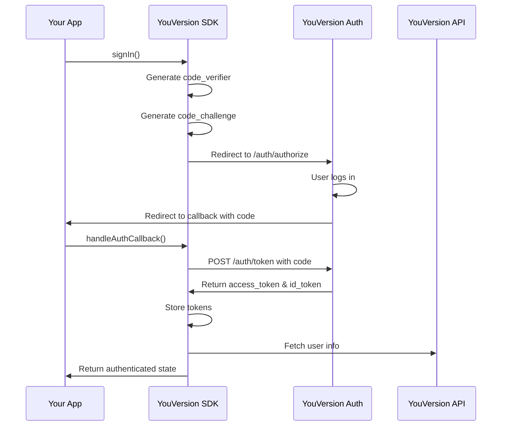

## Overview

The YouVersion Platform SDK implements **OAuth 2.0 with PKCE (Proof Key for Code Exchange)** for secure user authentication. This flow is designed for public clients (like browser-based apps) where client secrets cannot be securely stored.

<Info>
PKCE enhances security by using dynamically generated code verifiers and challenges, making authorization code interception attacks ineffective.
</Info>

## Authentication Flow

The OAuth 2.0 PKCE flow consists of several steps:



## Quick Start

### Step 1: Configure Authentication Provider

Wrap your app with `YouVersionProvider` and enable authentication:

```tsx
import { YouVersionProvider } from '@youversion/platform-react-hooks';

function App() {
  return (
    <YouVersionProvider
      appKey="your-app-key"
      includeAuth={true}
      authRedirectUrl="https://myapp.com/callback"
      theme="light"
    >
      <MyApp />
    </YouVersionProvider>
  );
}
```

<Note>
The `authRedirectUrl` must match the redirect URI configured in your YouVersion app settings.
</Note>

### Step 2: Implement Sign-In

Use the `useYVAuth` hook to trigger authentication:

```tsx
import { useYVAuth } from '@youversion/platform-react-hooks';

function SignInPage() {
  const { auth, signIn } = useYVAuth();

  const handleSignIn = async () => {
    try {
      await signIn();
      // User will be redirected to YouVersion
    } catch (error) {
      console.error('Sign in failed:', error);
    }
  };

  if (auth.isAuthenticated) {
    return <div>Already signed in!</div>;
  }

  return (
    <button onClick={handleSignIn} disabled={auth.isLoading}>
      {auth.isLoading ? 'Signing in...' : 'Sign In with YouVersion'}
    </button>
  );
}
```

### Step 3: Handle OAuth Callback

Create a callback page to process the authorization code:

```tsx
import { useYVAuth } from '@youversion/platform-react-hooks';
import { useEffect, useState } from 'react';
import { useNavigate } from 'react-router-dom';

function CallbackPage() {
  const { processCallback } = useYVAuth();
  const [isProcessing, setIsProcessing] = useState(true);
  const navigate = useNavigate();

  useEffect(() => {
    processCallback()
      .then(result => {
        if (result) {
          console.log('Authentication successful:', result.name);
          // Redirect to app
          navigate('/home');
        }
      })
      .catch(error => {
        console.error('Authentication failed:', error);
        navigate('/signin?error=auth_failed');
      })
      .finally(() => {
        setIsProcessing(false);
      });
  }, [processCallback, navigate]);

  return (
    <div>
      {isProcessing ? 'Processing authentication...' : 'Authentication complete'}
    </div>
  );
}
```

### Step 4: Access User Information

Once authenticated, access user info throughout your app:

```tsx
import { useYVAuth } from '@youversion/platform-react-hooks';

function UserProfile() {
  const { auth, userInfo, signOut } = useYVAuth();

  if (!auth.isAuthenticated || !userInfo) {
    return <div>Not signed in</div>;
  }

  return (
    <div>
      <h2>Welcome, {userInfo.name}!</h2>
      <p>Email: {userInfo.email}</p>
      <button onClick={signOut}>Sign Out</button>
    </div>
  );
}
```

## Core Layer Implementation

If you're not using React, you can use the core layer directly:

<CodeGroup>

```typescript Sign In
import { 
  SignInWithYouVersionPKCEAuthorizationRequestBuilder,
  SessionStorageStrategy 
} from '@youversion/platform-core';

const storage = new SessionStorageStrategy();

// Build authorization request
const { url, parameters } = await SignInWithYouVersionPKCEAuthorizationRequestBuilder.make(
  'your-app-key',
  new URL('https://myapp.com/callback'),
  ['openid', 'profile', 'email'] // optional scopes
);

// Store PKCE parameters for callback
storage.setItem('pkce_code_verifier', parameters.codeVerifier);
storage.setItem('pkce_state', parameters.state);
storage.setItem('pkce_nonce', parameters.nonce);

// Redirect user to authorization URL
window.location.href = url.toString();
```

```typescript Handle Callback
import { 
  SignInWithYouVersionPKCEAuthorizationRequestBuilder,
  YouVersionAPIUsers,
  SessionStorageStrategy 
} from '@youversion/platform-core';

const storage = new SessionStorageStrategy();
const urlParams = new URLSearchParams(window.location.search);
const code = urlParams.get('code');
const state = urlParams.get('state');

// Verify state
const storedState = storage.getItem('pkce_state');
if (state !== storedState) {
  throw new Error('State mismatch - potential CSRF attack');
}

// Retrieve stored code verifier
const codeVerifier = storage.getItem('pkce_code_verifier');
if (!codeVerifier) {
  throw new Error('Code verifier not found');
}

// Exchange authorization code for tokens
const request = SignInWithYouVersionPKCEAuthorizationRequestBuilder.tokenURLRequest(
  code!,
  codeVerifier,
  'https://myapp.com/callback'
);

const response = await fetch(request);
const tokens = await response.json();

// Get user info from ID token
const userInfo = YouVersionAPIUsers.userInfo(tokens.id_token);
console.log('User:', userInfo);
```

</CodeGroup>

## Storage Strategies

The SDK provides flexible storage strategies for managing authentication tokens:

### SessionStorage (Default)

Stores tokens in browser `sessionStorage`. Tokens persist during the browser session but are cleared when the tab/window is closed.

```typescript
import { SessionStorageStrategy } from '@youversion/platform-core';

const storage = new SessionStorageStrategy();
storage.setItem('auth_token', 'token_value');
const token = storage.getItem('auth_token');
```

<Warning>
**Security Warning:** SessionStorage is vulnerable to XSS attacks. If an attacker can inject JavaScript into your application, they can access all sessionStorage values.

For production applications handling sensitive tokens, consider:
1. Using secure, HTTP-only cookies
2. Storing tokens in memory only (requires re-auth on page reload)
3. Implementing a custom storage backend with additional security measures
</Warning>

### MemoryStorage

Stores tokens in memory only. Provides better XSS protection but requires re-authentication on page reload.

```typescript
import { MemoryStorageStrategy } from '@youversion/platform-core';

const storage = new MemoryStorageStrategy();
storage.setItem('auth_token', 'token_value');
const token = storage.getItem('auth_token');
// Token is cleared on page refresh
```

### Custom Storage

Implement your own storage strategy by implementing the `StorageStrategy` interface:

```typescript
import type { StorageStrategy } from '@youversion/platform-core';

class CustomStorageStrategy implements StorageStrategy {
  setItem(key: string, value: string): void {
    // Your custom implementation
    // Example: Encrypt before storing
  }

  getItem(key: string): string | null {
    // Your custom implementation
    // Example: Decrypt after retrieving
    return null;
  }

  removeItem(key: string): void {
    // Your custom implementation
  }

  clear(): void {
    // Your custom implementation
  }
}
```

## PKCE Implementation Details

The SDK automatically handles PKCE parameter generation:

<Tabs>
  <Tab title="Code Verifier">
    A cryptographically random string (32 bytes, base64url-encoded):
    
    ```typescript
    // Automatically generated by the SDK
    const codeVerifier = randomURLSafeString(32);
    // Example: "dBjftJeZ4CVP-mB92K27uhbUJU1p1r_wW1gFWFOEjXk"
    ```
  </Tab>
  
  <Tab title="Code Challenge">
    SHA-256 hash of the code verifier (base64url-encoded):
    
    ```typescript
    // Automatically generated by the SDK
    const challenge = await codeChallenge(verifier);
    // Uses S256 method (SHA-256)
    ```
  </Tab>
  
  <Tab title="State">
    Random string to prevent CSRF attacks:
    
    ```typescript
    // Automatically generated by the SDK
    const state = randomURLSafeString(24);
    // Must be verified on callback
    ```
  </Tab>
  
  <Tab title="Nonce">
    Random value to prevent replay attacks:
    
    ```typescript
    // Automatically generated by the SDK
    const nonce = randomURLSafeString(24);
    // Validated in ID token
    ```
  </Tab>
</Tabs>

## User Information

After successful authentication, the SDK decodes the ID token (JWT) to extract user information:

```typescript
export interface YouVersionUserInfo {
  sub: string;           // User ID
  name?: string;         // Full name
  email?: string;        // Email address
  email_verified?: boolean;
  picture?: string;      // Profile picture URL
  locale?: string;       // User's locale (e.g., "en-US")
  // ... additional OIDC claims
}
```

Access user info through the `useYVAuth` hook:

```tsx
const { userInfo } = useYVAuth();

console.log(userInfo?.sub);    // User ID
console.log(userInfo?.name);   // Display name
console.log(userInfo?.email);  // Email
```

## Authentication State

The `auth` object provides complete authentication state:

```typescript
interface AuthenticationState {
  isAuthenticated: boolean;  // True if user has valid tokens
  isLoading: boolean;        // True during auth flow
  accessToken: string | null;  // OAuth access token
  idToken: string | null;      // OIDC ID token (contains user info)
  error: Error | null;         // Authentication error if any
  result: SignInWithYouVersionResult | null;  // Auth result
}
```

Example usage:

```tsx
function ProtectedRoute({ children }) {
  const { auth } = useYVAuth();

  if (auth.isLoading) {
    return <LoadingSpinner />;
  }

  if (!auth.isAuthenticated) {
    return <Navigate to="/signin" />;
  }

  if (auth.error) {
    return <ErrorMessage error={auth.error} />;
  }

  return children;
}
```

## Scopes and Permissions

Request specific permissions using OAuth scopes:

```tsx
const { signIn } = useYVAuth();

// Request specific scopes
await signIn({
  redirectUrl: 'https://myapp.com/callback',
  scopes: ['openid', 'profile', 'email', 'highlights']
});
```

Available scopes:

| Scope | Description |
|-------|-------------|
| `openid` | Required - enables OIDC authentication |
| `profile` | Access to user's profile (name, picture) |
| `email` | Access to user's email address |
| `highlights` | Access to user's Bible highlights |

<Note>
The `openid` scope is automatically included even if not specified.
</Note>

## Token Management

The SDK automatically manages token refresh and expiration:

```typescript
import { YouVersionAPIUsers, YouVersionPlatformConfiguration } from '@youversion/platform-core';

// Check if token needs refresh
if (YouVersionPlatformConfiguration.refreshToken) {
  await YouVersionAPIUsers.refreshTokenIfNeeded();
}

// Access current tokens
const accessToken = YouVersionPlatformConfiguration.accessToken;
const idToken = YouVersionPlatformConfiguration.idToken;
```

## Sign Out

Clear authentication state and tokens:

```tsx
import { useYVAuth } from '@youversion/platform-react-hooks';

function SignOutButton() {
  const { signOut } = useYVAuth();

  return (
    <button onClick={signOut}>
      Sign Out
    </button>
  );
}
```

The `signOut` function:
1. Clears all stored tokens
2. Resets user info state
3. Clears storage (session/memory)

## Using the Pre-Built Auth Button

The UI package provides a ready-to-use authentication button:

```tsx
import { YouVersionAuthButton } from '@youversion/platform-react-ui';

function App() {
  return (
    <YouVersionAuthButton
      redirectUrl="https://myapp.com/callback"
      onAuthError={(error) => console.error('Auth error:', error)}
      mode="auto"        // "signIn" | "signOut" | "auto"
      size="default"     // "default" | "short" | "icon"
      variant="default"  // "default" | "outline"
      radius="rounded"   // "rounded" | "rectangular"
      background="light" // "light" | "dark"
    />
  );
}
```

The button automatically switches between "Sign In" and "Sign Out" when `mode="auto"`.

## Security Best Practices

<Warning>
**Important Security Considerations:**

1. **HTTPS Required** - Always use HTTPS in production
2. **Validate State** - Always verify the `state` parameter on callback
3. **Secure Storage** - Consider HTTP-only cookies for token storage
4. **Token Expiration** - Implement proper token refresh logic
5. **XSS Prevention** - Sanitize user input and use Content Security Policy
6. **Redirect URI Validation** - Ensure redirect URIs match exactly
</Warning>

## Troubleshooting

### State Mismatch Error

**Problem:** `State mismatch - potential CSRF attack`

**Solution:** Ensure the `state` parameter from the callback matches the stored state. This can happen if:
- Browser storage was cleared between redirect
- User opened the callback URL directly
- Multiple auth flows are running simultaneously

### Code Verifier Not Found

**Problem:** `Code verifier not found`

**Solution:** The PKCE code verifier was not stored or was cleared. Ensure:
- Storage is working correctly
- User hasn't cleared cookies/storage
- Code verifier is stored before redirect

### Token Expired

**Problem:** API calls fail with 401 Unauthorized

**Solution:** Implement automatic token refresh:

```typescript
import { YouVersionAPIUsers } from '@youversion/platform-core';

try {
  await YouVersionAPIUsers.refreshTokenIfNeeded();
  // Retry the API call
} catch (error) {
  // Token refresh failed - re-authenticate
  signOut();
}
```

## Next Steps

<CardGroup cols={2}>
  <Card title="Architecture" icon="sitemap" href="/concepts/architecture">
    Learn about the three-layer SDK architecture
  </Card>
  <Card title="Data Fetching" icon="download" href="/guides/fetching-data">
    Fetch Bible data with authentication
  </Card>
</CardGroup>
